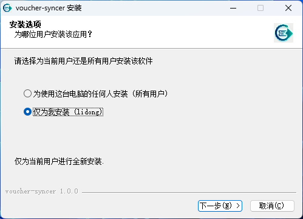
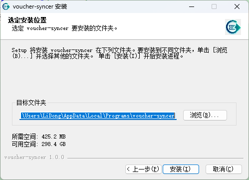
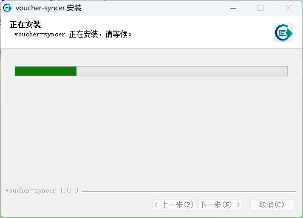
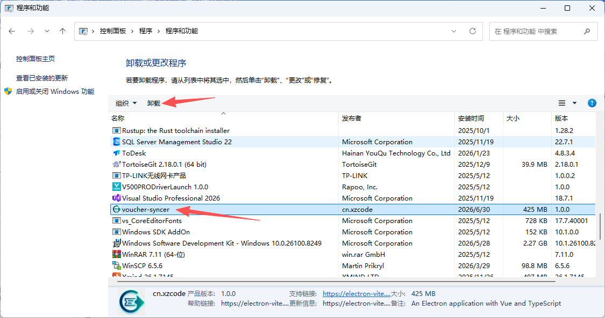
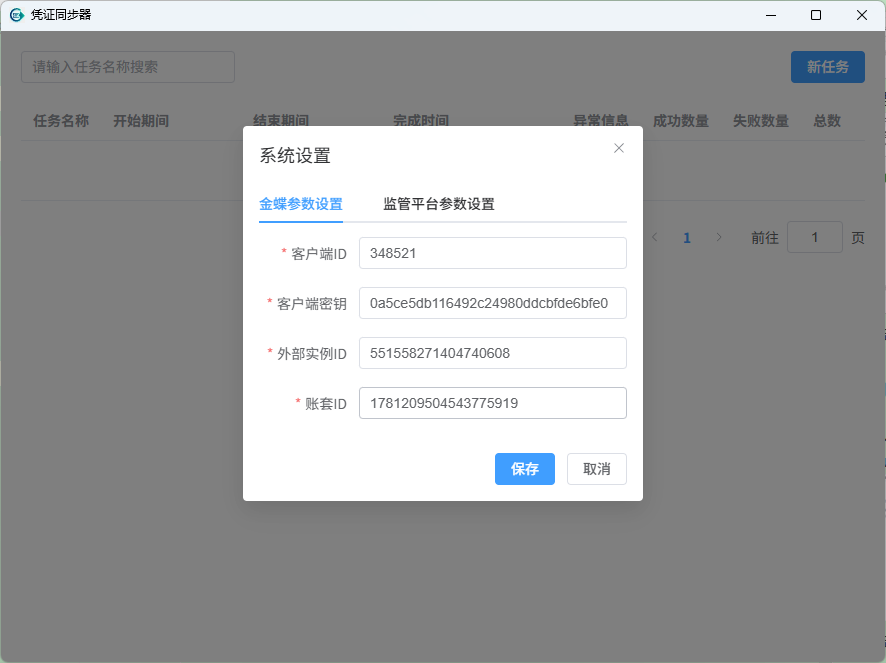
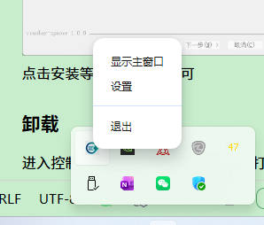
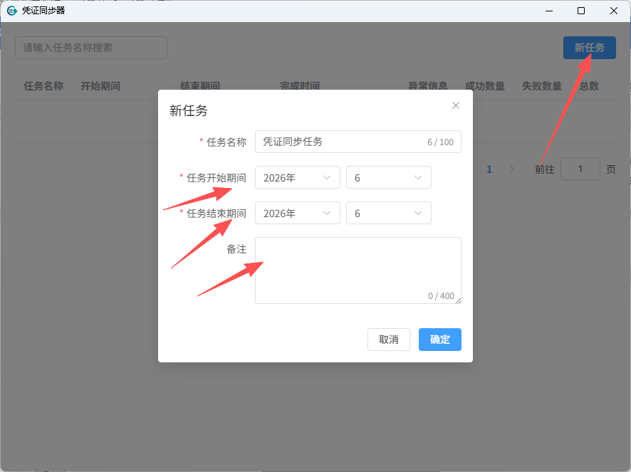
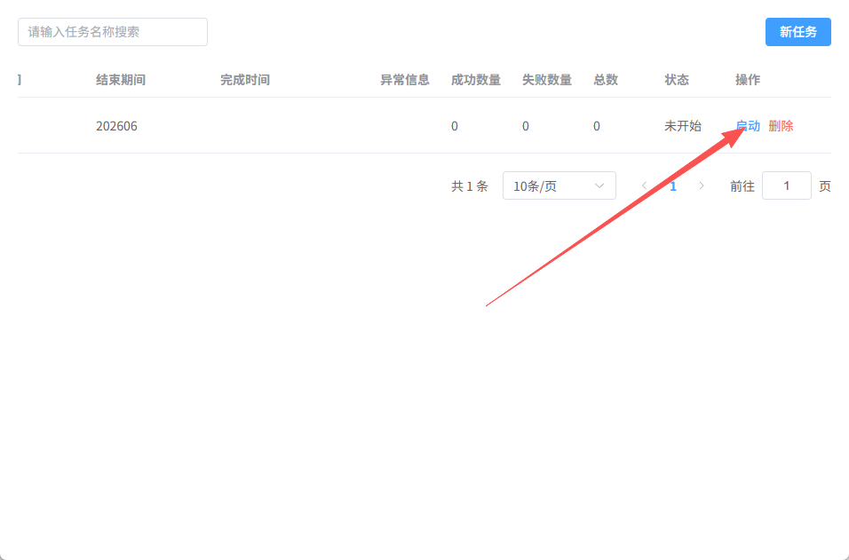
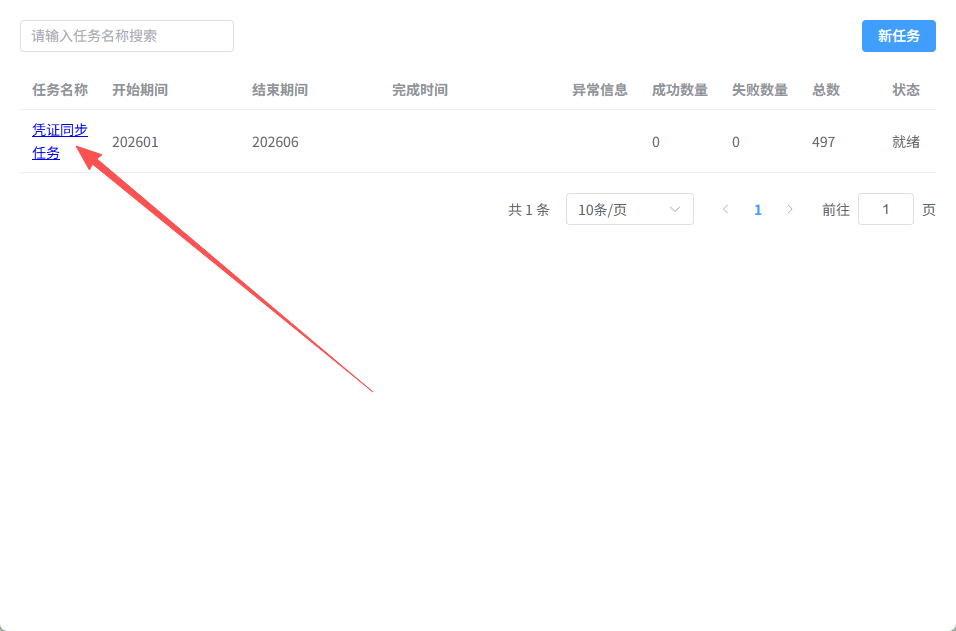
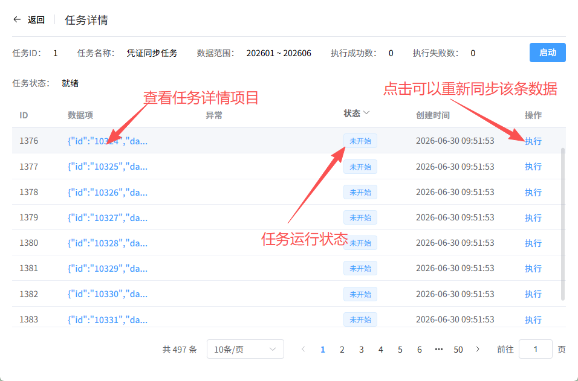

## 安装和卸载

### 安装

双击安装包,按照界面提示进行程序安装  
  
这一页推荐选择仅为我安装  
  
这里选择默认即可  
  
点击安装等待进度完成即可

### 卸载

进入控制面板，找到程序和功能，找打voucher-syncer
  
点击卸载即可完成程序的卸载

## 程序配置

双击桌面的快捷图标，启动应用，在程序首次运行时，必须填写相关的配置信息。

  
根据实际情况填入相关信息即可，填写完成后点击保存。即可完成程序的配置，点击保存。  
如果后续的相关信息发生变化。在运行程序后，右键点击程序的托盘图标  
  
点击设置按钮，即可重新弹出程序配置页面。重新配置保存即可

## 数据同步

### 新增同步任务

  
点击界面右上角的新任务。在弹出的对话框中，输入要同步的凭证的区间范围。点击确定

### 启动任务

  
点击任务列表中的启动按钮，即可启动该任务。等待任务完成即可

### 查看同步详情

  
点击任务列表中的任务名称链接，即可查看该任务的同步详情。

  
点击任务详情页面执行按钮，可以重新执行该任务（当任务失败或者错误时，可以用该功能重试）。
